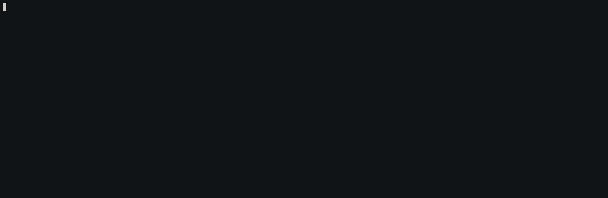

# Google Cloud Buildpacks Getting Started

Google Cloud Buildpacks enables you to create Cpntainer images without **Dockerfile**

## Description
### pack CLI
Pack is a tool maintained by the Cloud Native Buildpacks project to support the use of buildpacks. It enables the following functionality:

1. `build` an application
2. `rebase` application created images
3. Creation of various `components` used within the ecosystem.

#### Installation
##### MacOS - Homebrew
```
brew install buildpacks/tap/pack
```

##### Container
`pack` is available as a container image from `buildpacksio/pack`

- buildpacksio/pack:latest
or
- buildpacksio/pack:0.14.2

You need to mount your local Docker daemon's socket when you use it as a container.

```
$ docker run \
    -v /var/run/docker.sock:/var/run/docker.sock \
    -v $PWD:/workspace -w /workspace \
    buildpacksio/pack build <IMAGE_NAME> --builder <BUILDER_IMAGE>
```

#### Usage - pack cli
##### Build
Generate container image from source code

```
$ pack build <IMAGE_NAME> [OPTIONS]
```

|Option|Explanation|
|------|-----------|
|-B, --builder|Builder Image|
|-b, --buildpack|Buildpack reference in the form of '<buildpack>@<version>'|
|--clear-cache|Clear image's associated cache|
|-e, --env|Build-time environment variable, in the form 'VAR=VALUE' or 'VAR'.|
|--env-file|Build-time environment variables file (defaults to current working directory)|
|-p, --path|Path to app |
|--publish|Publish to registry|
|--pull-policy|always (default)<br>never<br>if-not-present|
|--volume|Mount host volume into the build container<br>'\<host path\>:\<target path\>[:\<mode\>]'|

##### Builder
|Name|Builder Name|Explanation|
|----|------------|-----------|
|Google|gcr.io/buildpacks/builder:v1|Ubuntu 18 base image with buildpacks for .NET, Go, Java, Node.js, and Python|
|Heroku|heroku/buildpacks:18|heroku-18 base image with buildpacks for Ruby, Java, Node.js, Python, Golang, & PHP|
|Paketo Buildpacks|paketobuildpacks/builder:base|Ubuntu bionic base image with buildpacks for Java, NodeJS and Golang|
|Paketo Buildpacks|paketobuildpacks/builder:full|Ubuntu bionic base image with buildpacks for Java, .NET, NodeJS, Golang, PHP, HTTPD and NGINX|
|Paketo Buildpacks|paketobuildpacks/builder:tiny|Tiny base image (bionic build image, distroless run image) with buildpacks for Golang|

##### Rebase

Rebase app image with latest run image

```
$ pack rebase <IMAGE_NAME> [OPTIONS]
```

##### Publish to Registry

- Publish to **Docker Hub**

```
$ pack build <REGISRY_NAME>/<NAME>:<TAG> --builder gcr.io/buildpacks/builder:v1 --publish

$ pack build shinyay/demo-app:0.0.1 --builder gcr.io/buildpacks/builder:v1 --publish
```

- Publish to **Google Container Registry**

```
$ pack build gcr.io/<GCP_PROJECT_NAME>/<NAME>:<TAG> --builder gcr.io/buildpacks/builder:v1 --publish

$ pack build gcr.io/shinyay-demo-project/demo-app:0.0.1 --builder gcr.io/buildpacks/builder:v1 --publish
```

#### Usage - Google Cloud Build
Google Cloud Build process can invoke Google Cloud Buildpacks

```
$ gcloud alpha builds submit --pack image=gcr.io/(gcloud config get-value project)/<NAME>

$ gcloud alpha builds submit --pack image=gcr.io/(gcloud config get-value project)/demo-app
```

## Demo



## Features

- feature:1
- feature:2

## Requirement

## Usage

## Installation

## Licence

Released under the [MIT license](https://gist.githubusercontent.com/shinyay/56e54ee4c0e22db8211e05e70a63247e/raw/34c6fdd50d54aa8e23560c296424aeb61599aa71/LICENSE)

## Author

[shinyay](https://github.com/shinyay)